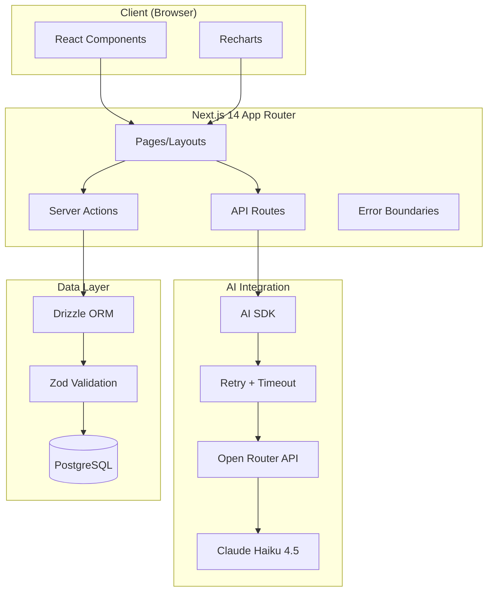
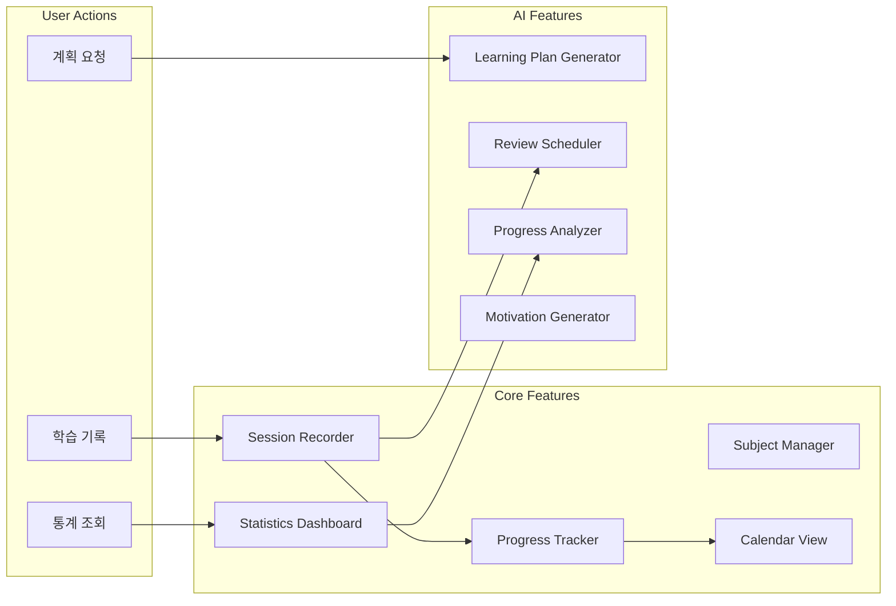
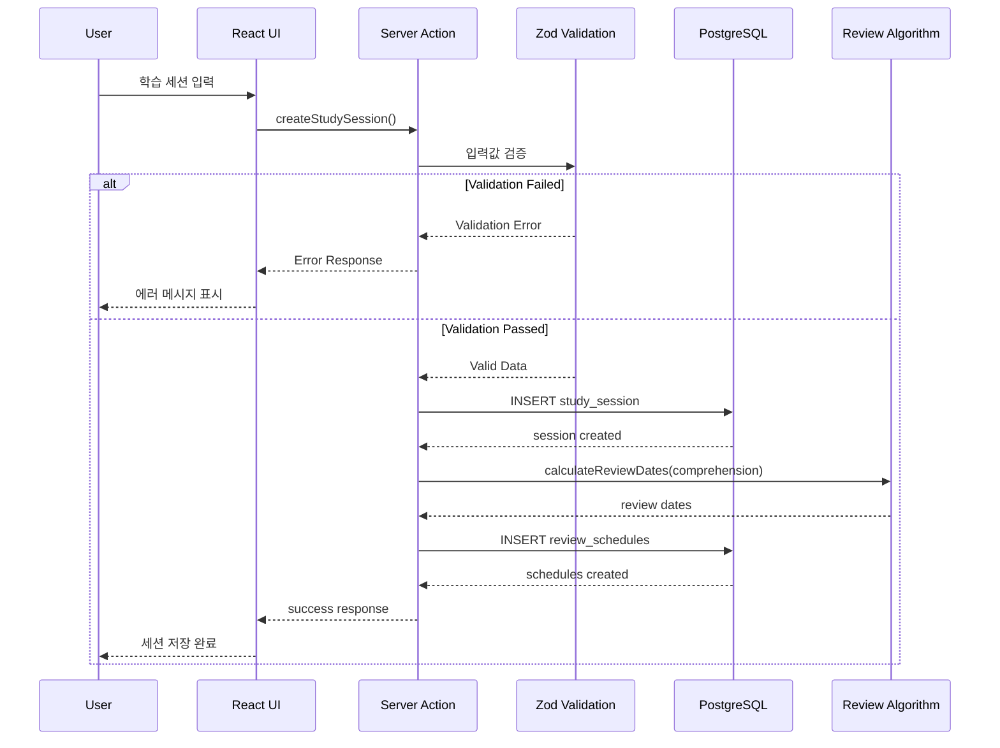
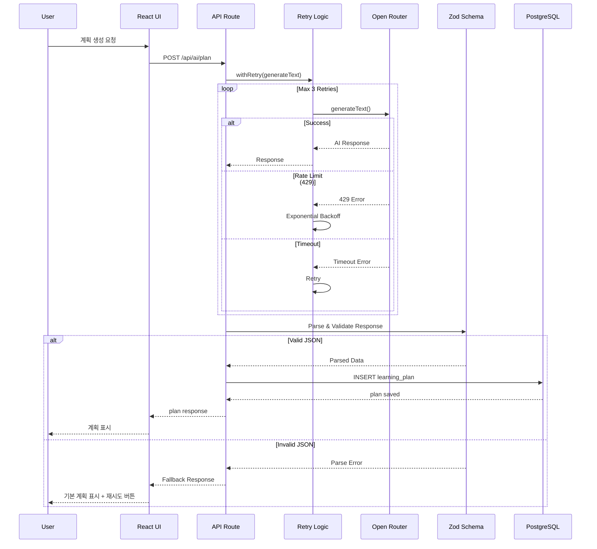
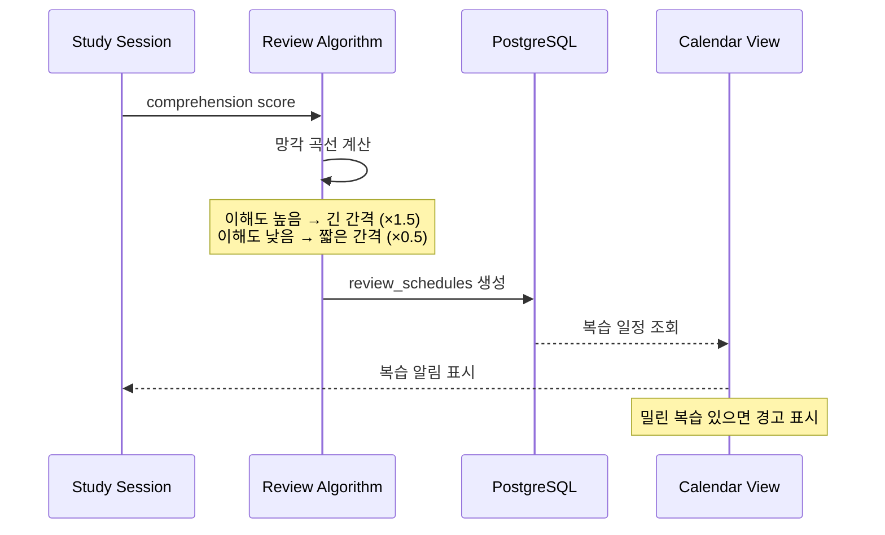
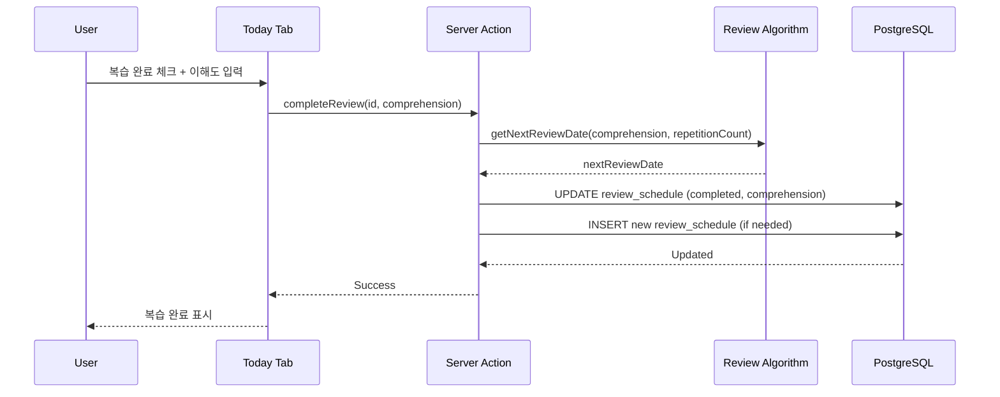
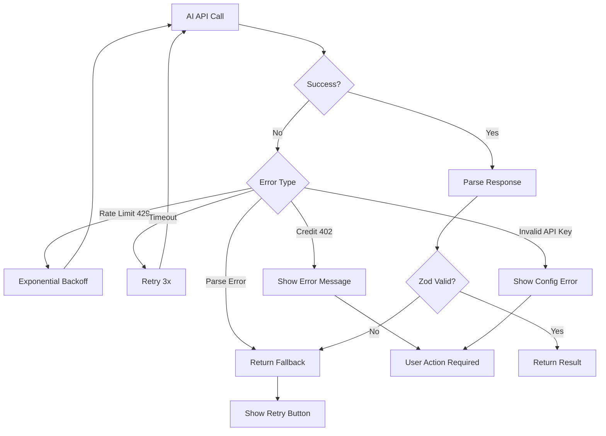

# AI Study Planner - Architecture Document

## 1. System Overview

### 1.1 Project Purpose
AI 기반 학습 계획 및 관리 시스템. 과목별 학습 기록, AI 학습 계획 생성, 망각 곡선 기반 복습 스케줄링, 학습 패턴 분석 기능 제공.

### 1.2 Target Users
- 체계적으로 공부하고 싶은 학생
- 자격증/시험 준비자
- 효율적인 복습 스케줄이 필요한 사람
- AI 기반 학습 최적화 희망자

### 1.3 Key Constraints
- Single-user 애플리케이션 (인증 불필요)
- PostgreSQL 기존 Docker 컨테이너 활용
- Open Router API 의존 (AI 기능)
- 2시간 내 구현 목표

---

## 2. Architecture Diagram

### 2.1 System Architecture



### 2.2 Component Interaction



---

## 3. Core Components

### 3.1 Subject Manager
과목 CRUD 및 목표 관리
- 과목 등록/수정/삭제
- 난이도 레벨 설정
- 시험일/목표 점수 관리
- 색상 지정
- **CASCADE 삭제 (연관 세션, 계획, 복습 일정 자동 삭제)**

### 3.2 Session Recorder
학습 세션 기록
- 날짜, 시간, 과목 선택
- 토픽 및 소요 시간
- 이해도 (1-5) 입력
- 메모 저장
- **세션 생성 시 복습 일정 자동 생성**

### 3.3 Progress Tracker
진행도 추적
- 과목별 총 학습 시간 집계
- 토픽별 완료도 계산
- 이해도 평균 산출
- 목표 대비 진행률

### 3.4 Calendar View
캘린더 기반 시각화
- 월별/년별 학습 기록 표시
- 복습 일정 표시
- 과목별 색상 구분
- **빈 상태 처리**

### 3.5 Statistics Dashboard
통계 시각화
- 주간/월간 학습 시간 (Bar Chart)
- 과목별 분포 (Pie Chart)
- 이해도 추이 (Line Chart)
- **dynamic import로 SSR 이슈 방지**

### 3.6 AI Learning Plan Generator
AI 학습 계획 생성
- 목표/현재 수준 입력
- 주간 계획 자동 생성
- 일별 학습량 배분
- 우선순위 설정
- **계획 상태 관리 (active/completed/archived)**

### 3.7 AI Review Scheduler
망각 곡선 기반 복습 스케줄링
- 이해도 기반 복습 간격 조정
- 복습 일정 자동 생성
- 복습 완료 체크 및 갱신
- **복습 시 이해도 재평가**
- **밀린 복습 일괄 완료**

### 3.8 AI Progress Analyzer
학습 진도 분석
- 강점/약점 과목 파악
- 학습 효율성 분석
- 목표 달성 가능성 예측
- 개선 제안

---

## 4. Data Flow

### 4.1 Study Session Creation Flow



### 4.2 AI Plan Generation Flow



### 4.3 Review Scheduling Flow



### 4.4 Review Completion Flow



---

## 5. Technology Stack Details

| Layer | Technology | Purpose |
|-------|------------|---------|
| Framework | Next.js 14 (App Router) | SSR, Server Actions, API Routes |
| Language | TypeScript (strict) | 타입 안정성 |
| Database | PostgreSQL | 관계형 데이터 저장 |
| ORM | Drizzle | 타입 안전 쿼리, 마이그레이션 |
| UI Framework | shadcn/ui | 재사용 가능한 컴포넌트 |
| Styling | Tailwind CSS | 유틸리티 기반 스타일링 |
| Charts | Recharts | React 기반 차트 라이브러리 |
| AI SDK | Vercel AI SDK | 구조화된 출력 |
| AI Provider | Open Router | 다양한 AI 모델 접근 |
| AI Model | Claude Haiku 4.5 | 빠른 응답, 비용 효율 |
| Validation | Zod | 런타임 타입 검증 |

---

## 6. File Structure

```
app/
├── layout.tsx              # Root layout
├── page.tsx                # Main dashboard (Today tab)
├── loading.tsx             # Global loading UI
├── error.tsx               # Global error boundary
├── not-found.tsx           # 404 page
├── calendar/
│   ├── page.tsx            # Calendar view
│   └── loading.tsx
├── statistics/
│   ├── page.tsx            # Statistics dashboard
│   └── loading.tsx
├── plan/
│   ├── page.tsx            # AI learning plans
│   └── loading.tsx
├── analysis/
│   ├── page.tsx            # AI progress analysis
│   └── loading.tsx
└── api/
    └── ai/
        ├── plan/route.ts           # Learning plan generation
        ├── recommend/route.ts      # Study method recommendation
        ├── analyze/route.ts        # Progress analysis
        └── motivation/route.ts     # Motivation messages

components/
├── ui/                     # shadcn/ui components
├── empty-state.tsx         # Empty state component
├── loading-spinner.tsx     # Loading spinner
├── subjects/
│   ├── subject-form.tsx
│   ├── subject-list.tsx
│   └── subject-dialog.tsx
├── sessions/
│   ├── session-form.tsx
│   ├── session-list.tsx
│   └── session-dialog.tsx
├── calendar/
│   └── study-calendar.tsx
├── charts/                 # All use dynamic import
│   ├── weekly-bar-chart.tsx
│   ├── subject-pie-chart.tsx
│   └── comprehension-line-chart.tsx
├── plan/
│   ├── plan-form.tsx
│   └── plan-view.tsx
└── analysis/
    └── analysis-view.tsx

db/
├── index.ts                # Database connection
└── schema.ts               # Drizzle schema (5 tables + indexes)

actions/
├── subjects.ts             # Subject CRUD actions
├── sessions.ts             # Session CRUD actions
├── plans.ts                # Plan actions
└── reviews.ts              # Review actions

lib/
├── ai/
│   ├── openrouter.ts       # Open Router client setup
│   ├── prompts.ts          # AI prompt templates
│   ├── schemas.ts          # Zod schemas for AI responses
│   ├── utils.ts            # Retry, timeout utilities
│   └── review-algorithm.ts # 망각 곡선 알고리즘
├── utils.ts                # Utility functions
└── types.ts                # TypeScript types
```

---

## 7. Key Design Decisions

### 7.1 망각 곡선 (Forgetting Curve) Algorithm

**선택 이유:**
- Ebbinghaus의 망각 곡선은 과학적으로 검증된 기억 유지 모델
- 간격 반복 학습(Spaced Repetition)의 효과 입증됨
- 이해도에 따른 동적 간격 조정 가능

**구현 방식:**
```typescript
// 기본 복습 간격 (일) - 장기 복습 포함
const BASE_INTERVALS = [1, 3, 7, 14, 30, 60, 90];

// 이해도에 따른 간격 조정
function calculateIntervals(comprehension: number): number[] {
  const multiplier = comprehension >= 4 ? 1.5 : comprehension <= 2 ? 0.5 : 1;
  return BASE_INTERVALS.map(i => Math.round(i * multiplier));
}

// Edge Case: 밀린 복습 처리
function getNextReviewDate(currentDate: Date, comprehension: number, repetitionCount: number): Date {
  const idx = Math.min(repetitionCount, BASE_INTERVALS.length - 1);
  const interval = BASE_INTERVALS[idx] * getMultiplier(comprehension);
  const nextDate = addDays(currentDate, Math.round(interval));

  // 과거 날짜 방지
  const today = new Date();
  today.setHours(0, 0, 0, 0);
  return nextDate <= today ? addDays(today, 1) : nextDate;
}
```

### 7.2 AI Prompt Strategy

**선택 이유:**
- 구조화된 JSON 출력으로 파싱 안정성 확보
- 역할 지정으로 일관된 응답 품질
- 구체적인 요구사항으로 할루시네이션 최소화

**핵심 원칙:**
- System prompt에서 전문가 역할 부여
- 명확한 입력/출력 포맷 지정
- JSON Schema로 구조화된 응답 요구
- Zod로 응답 검증 필수

### 7.3 Chart Library Choice (Recharts)

**선택 이유:**
- React 친화적 (선언적 컴포넌트)
- 반응형 지원 내장
- 커스터마이징 용이
- 번들 사이즈 적절 (~150KB)
- 활발한 유지보수

**SSR 이슈 해결:**
```typescript
// dynamic import로 SSR 비활성화 필수
'use client';
import dynamic from 'next/dynamic';

const BarChart = dynamic(
  () => import('recharts').then(mod => mod.BarChart),
  { ssr: false }
);
```

**대안 비교:**
| Library | 장점 | 단점 |
|---------|------|------|
| Recharts | React 친화적, 쉬운 사용 | 고급 기능 제한 |
| Chart.js | 다양한 차트 타입 | React wrapper 필요 |
| D3.js | 완전한 커스터마이징 | 학습 곡선 높음 |
| Nivo | 아름다운 디자인 | 번들 사이즈 큼 |

### 7.4 Server Actions vs API Routes

**결정:**
- CRUD 작업: Server Actions (간결한 코드)
- AI 호출: API Routes (타임아웃 처리, 재시도 로직)

---

## 8. AI Integration Architecture

### 8.1 Open Router Setup

```typescript
// lib/ai/openrouter.ts
import { createOpenAI } from '@ai-sdk/openai';

export const openrouter = createOpenAI({
  baseURL: 'https://openrouter.ai/api/v1',  // IMPORTANT: 필수
  apiKey: process.env.OPENROUTER_API_KEY,
});

// Haiku 4.5 - 빠른 응답, 비용 효율
export const model = openrouter('anthropic/claude-haiku-4-5-20250514');
```

### 8.2 Retry & Timeout Utilities

```typescript
// lib/ai/utils.ts
export async function withRetry<T>(
  fn: () => Promise<T>,
  options: { maxRetries?: number; baseDelay?: number } = {}
): Promise<T> {
  const { maxRetries = 3, baseDelay = 1000 } = options;

  for (let attempt = 0; attempt < maxRetries; attempt++) {
    try {
      return await fn();
    } catch (error) {
      if (attempt === maxRetries - 1) throw error;

      if (isRetryableError(error)) {
        const delay = baseDelay * Math.pow(2, attempt);  // Exponential backoff
        await sleep(delay);
        continue;
      }
      throw error;
    }
  }
  throw new Error('Max retries exceeded');
}

function isRetryableError(error: unknown): boolean {
  if (error instanceof Error) {
    const message = error.message.toLowerCase();
    return message.includes('429') ||
           message.includes('rate limit') ||
           message.includes('5') ||
           message.includes('timeout');
  }
  return false;
}
```

### 8.3 Model Selection

| Model | 용도 | 이유 |
|-------|------|------|
| Claude Haiku 4.5 | 모든 AI 기능 | 빠른 응답, 비용 효율, 충분한 성능 |

### 8.4 Prompt Templates Location

```
lib/ai/prompts.ts
├── LEARNING_PLAN_PROMPT      # 학습 계획 생성
├── STUDY_METHOD_PROMPT       # 학습 방법 추천
├── PROGRESS_ANALYSIS_PROMPT  # 진도 분석
└── MOTIVATION_PROMPT         # 동기부여 메시지
```

### 8.5 Error Handling



### 8.6 Edge Cases

| Case | HTTP Code | 처리 방법 | UI 표시 |
|------|-----------|----------|---------|
| API 타임아웃 | - | 30초 타임아웃, 재시도 | "응답이 느립니다. 다시 시도해주세요" |
| 잘못된 JSON | - | Zod 검증 실패, fallback | 기본 응답 + 재시도 버튼 |
| Rate Limit | 429 | 지수 백오프 (1s, 2s, 4s) | 로딩 표시 유지 |
| 크레딧 부족 | 402 | 즉시 에러 반환 | "AI 크레딧이 부족합니다" |
| API 키 무효 | 401 | 즉시 에러 반환 | "API 설정을 확인해주세요" |
| 빈 학습 데이터 | - | 기본 템플릿 제공 | "학습 기록을 먼저 추가하세요" |
| 토큰 초과 | 400 | 입력 데이터 요약 후 재시도 | 자동 재시도 |

---

## 9. Performance & Security

### 9.1 Database Indexes

```sql
-- 주요 인덱스
CREATE INDEX idx_sessions_subject_id ON study_sessions(subject_id);
CREATE INDEX idx_sessions_date ON study_sessions(date DESC);
CREATE INDEX idx_reviews_date ON review_schedules(review_date);
CREATE INDEX idx_reviews_pending ON review_schedules(review_date, completed)
  WHERE completed = false;
CREATE INDEX idx_plans_week ON learning_plans(week_start, week_end);
```

### 9.2 AI API Optimization

- **요청 최소화:** 캐싱, 배치 처리
- **응답 최적화:** 구조화된 출력 (Zod schema)
- **비용 관리:** 입력 토큰 제한, 요약 전처리
- **타임아웃:** 30초 제한

### 9.3 Input Validation

```typescript
// Zod 스키마로 모든 입력 검증
const sessionSchema = z.object({
  subjectId: z.string().uuid(),
  topic: z.string().min(1).max(200),
  duration: z.number().min(1).max(480),
  comprehension: z.number().min(1).max(5),
  notes: z.string().max(1000).optional(),
  date: z.string().date(),
});
```

### 9.4 Error Handling Strategy

| Layer | 전략 |
|-------|------|
| UI | try-catch + toast 알림 + 재시도 버튼 |
| Server Actions | Error boundary + 로깅 |
| API Routes | HTTP 상태 코드 + JSON 에러 |
| Database | Transaction rollback |
| AI | Retry + Timeout + Fallback 응답 |

---

## 10. UI/UX Considerations

### 10.1 Loading States

| 상태 | 구현 |
|------|------|
| 페이지 로딩 | `loading.tsx` (Suspense) |
| 데이터 로딩 | Spinner + 메시지 |
| AI 생성 중 | Spinner + "AI가 계획을 생성하고 있습니다..." |
| 저장 중 | Button disabled + "저장 중..." |

### 10.2 Empty States

| 상황 | 메시지 |
|------|--------|
| 과목 없음 | "과목을 추가해주세요" + 추가 버튼 |
| 오늘 세션 없음 | "오늘 학습 기록이 없습니다" + 추가 버튼 |
| 복습 없음 | "예정된 복습이 없습니다" |
| 통계 데이터 없음 | "학습 기록이 필요합니다" |

### 10.3 Error States

| 에러 | UI 처리 |
|------|---------|
| 네트워크 오류 | 토스트 알림 + 재시도 버튼 |
| AI 오류 | 에러 메시지 + 재시도 버튼 |
| 검증 오류 | 필드 아래 에러 메시지 |
| 서버 오류 | error.tsx 페이지 |

---

## 11. Summary

AI Study Planner는 Next.js 14 기반의 학습 관리 시스템으로, 망각 곡선 알고리즘과 AI 기반 학습 계획 생성을 핵심으로 한다.

**핵심 설계 원칙:**
1. Server Actions와 API Routes를 적절히 분리 (CRUD vs AI)
2. Zod를 통한 철저한 입/출력 검증
3. AI API 호출 시 retry + timeout + fallback 필수
4. Recharts는 dynamic import로 SSR 이슈 방지
5. 모든 FK에 ON DELETE CASCADE 적용
6. 복습 완료 시 이해도 재평가 및 다음 복습일 계산
7. 빈 상태, 로딩 상태, 에러 상태 모두 처리
